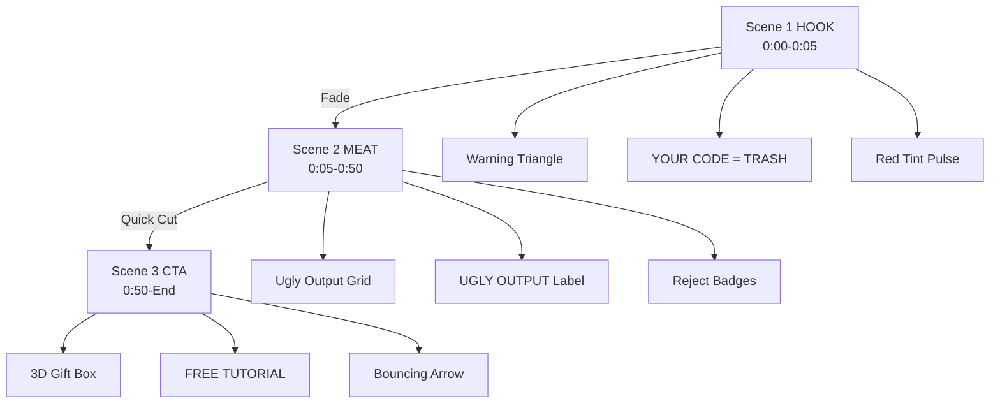

# 🎬 Video Spec: Extract_Short_2_Pain_Garbage_Alert

## Overview
| Property | Value |
|----------|-------|
| **Type** | Short (9:16) |
| **Duration** | ~60 seconds (1800 frames @ 30fps) |
| **Resolution** | 1080x1920 |
| **FPS** | 30 |
| **Composition ID** | `ExtractShort2PainGarbageAlert` |
| **Style** | Cyberpunk (Provocative/Warning Theme) |

## Rules I Read Before Writing This Spec
- [x] animations.md
- [x] timing.md
- [x] sequencing.md
- [x] text-animations.md
- [x] fonts.md
- [x] assets.md
- [x] images.md
- [x] transitions.md

## Creative Direction
**Theme:** Provocative Pain Point. High contrast, warning signals, aggressive red accents to emphasize the "garbage output" message.
**Vibe:** Shock value, call-out energy, transformation teaser.

### Color Palette (Cyberpunk - Warning Variant)
| Color | Hex | Usage |
|-------|-----|-------|
| Background | #111827 | Main bg - dark gray |
| Primary Neon | #3B82F6 | Neon blue accents (for contrast) |
| Secondary Neon | #8B5CF6 | Neon purple accents |
| Warning Yellow | #F59E0B | Triangle warning sign, highlights |
| Error Red | #EF4444 | Background tint, "TRASH" text, alerts |
| Text Primary | #FFFFFF | Main headings, white |
| Text Secondary | #94A3B8 | Body text, muted |
| Grid Lines | #1F2937 | UI guides, borders |
| Gift Gold | #F59E0B | 3D gift box, CTA elements |

### Typography
| Font | Family | Usage |
|------|--------|-------|
| Primary | 'Inter', sans-serif | UI Elements, Labels, Body |
| Display | 'Inter', sans-serif (900 weight) | "YOUR CODE = TRASH", Big headlines |
| Mono | 'Roboto Mono', monospace | Code elements, technical labels |

---

## Scene Breakdown

### Scene 1: HOOK - Warning Sign + Provocative Text (0:00-0:05)
**Duration:** 150 frames (0:00-0:05)
**Audio:** "This is the garbage you're producing right now."

#### Visual Elements
- [ ] **Warning Triangle**: Yellow triangle with pulsing exclamation mark
- [ ] **Provocative Text**: "YOUR CODE = TRASH" in large, bold red text
- [ ] **Red Tint Overlay**: Full-screen red overlay that pulses
- [ ] **Background**: Dark gray with subtle glitch static
- [ ] **Scanlines**: CRT-style scanline effect for tech aesthetic

#### Animations Table
| Element | Animation | Frames | Easing |
|---------|-----------|--------|--------|
| Warning Triangle | Scale pulse | 0-150 | easeInOut |
| Triangle Opacity | Fade in | 0-15 | easeOut |
| Exclamation Mark | Slide down | 0-20 | spring |
| "YOUR CODE =" | Slide from top | 15-45 | snappy |
| "TRASH" | Glitch reveal | 30-60 | easeOut |
| Red Tint | Opacity pulse 0.1→0.3→0.1 | 0-150 | loop |
| Glitch Static | Random displacement | 0-150 | loop |
| Scanlines | Horizontal scroll | 0-150 | linear |
| Text Glitch | Character swap | 60-150 | loop |

#### Code Approach
```tsx
// Warning triangle pulse
const triangleScale = interpolate(frame, [0, 75, 150], [1, 1.1, 1], {
  easing: Easing.inOut(Easing.quad),
});

// Red tint pulse effect
const redOpacity = interpolate(frame, [0, 75, 150], [0.1, 0.3, 0.1], {
  easing: Easing.inOut(Easing.quad),
});

// Glitch text effect
const glitchChars = ['T', 'R', 'A', 'S', 'H'];
const displayChar = glitchChars[Math.floor(frame / 10) % glitchChars.length];

// Warning triangle path (SVG)
const trianglePath = "M0,-80 L70,60 L-70,60 Z";
```

---

### Scene 2: MEAT - Ugly/Vanilla AI Output Showcase (0:05-0:50)
**Duration:** 1350 frames (0:05-0:50)
**Audio:** (Clip from Main Video: Ugly Output)

#### Visual Elements
- [ ] **Grid Display**: 2x2 or 3x3 grid of ugly AI outputs
- [ ] **Bad Examples**: 
  - Awkward spacing between elements
  - Clashing colors (orange on purple, etc.)
  - Generic/vanilla styling
  - Misaligned borders
- [ ] **"UGLY OUTPUT" Label**: Red banner across top
- [ ] **Flickering**: Brief moments of flicker to emphasize poor quality
- [ ] **Reject Badges**: "X" marks or red crosses over each bad example

#### Animations Table
| Element | Animation | Frames | Easing |
|---------|-----------|--------|--------|
| Grid Container | Fade in | 0-30 | easeOut |
| Bad Example 1 | Glitch shake | 30-450 | loop |
| Bad Example 2 | Color shift flicker | 30-450 | loop |
| Bad Example 3 | Slide wrong direction | 30-450 | easeInOut |
| Bad Example 4 | Opacity flicker | 30-450 | loop |
| "UGLY OUTPUT" | Typewriter | 15-45 | linear |
| Reject Badge 1 | Scale 0→1 + Rotate | 45-75 | spring |
| Reject Badge 2 | Scale 0→1 + Rotate | 60-90 | spring |
| Reject Badge 3 | Scale 0→1 + Rotate | 75-105 | spring |
| Reject Badge 4 | Scale 0→1 + Rotate | 90-120 | spring |
| Global Flicker | Opacity 1→0.8→1 | 0-1350 | loop |
| Grid Items | Stagger fade out | 1350-1400 | easeOut |

#### Code Approach
```tsx
// Glitch shake for bad examples
const shakeOffset = useMemo(() => {
  return Array.from({ length: 1350 }).map(() => 
    Math.random() > 0.95 ? (Math.random() - 0.5) * 15 : 0
  );
}, []);

const xOffset = shakeOffset[frame] || 0;
const yOffset = shakeOffset[frame] || 0;

// Color flicker effect
const colorFlicker = interpolate(frame, [0, 1350], [0, 1], {
  easing: Easing.step(5),
});

// Reject badge rotation
const badgeRotation = interpolate(frame, [45, 75], [0, 360], {
  extrapolateLeft: 'clamp',
  extrapolateRight: 'clamp',
});
```

---

### Scene 3: CTA - 3D Gift Box Reveal (0:50-End)
**Duration:** 300 frames (0:50-0:60)
**Audio:** "There's a fix. And it's free. Full tutorial linked below 👇"

#### Visual Elements
- [ ] **3D Gift Box**: Closed box that opens to reveal contents
- [ ] **"FREE TUTORIAL" Text**: Emerges from the opened box with glow effect
- [ ] **Arrow Animation**: Points downward toward comments/description
- [ ] **Sparkle Effects**: Celebration particles around the reveal
- [ ] **Gradient Background**: Smooth transition from warning red to hopeful blue/purple

#### Animations Table
| Element | Animation | Frames | Easing |
|---------|-----------|--------|--------|
| Background | Red→Purple gradient | 0-30 | easeInOut |
| Gift Box Base | Scale 0→1 | 15-45 | spring |
| Gift Box Lid | Slide up + Fade | 30-60 | snappy |
| Ribbon | Appear with glow | 45-75 | easeOut |
| "FREE TUTORIAL" | Scale 0→1 + Slide up | 75-120 | spring |
| Text Glow | Pulse | 120-300 | loop |
| Arrow | Bounce down | 120-180 | bounce |
| Arrow | Repeat bounce | 210-270 | bounce |
| Sparkles | Pop around box | 90-150 | spring |
| Sparkles | Continuous pop | 180-300 | loop |
| CTA Pulse | Ring expand | 150-300 | linear |

#### Code Approach
```tsx
// Gift box lid slide up
const lidY = interpolate(frame, [30, 60], [0, -200], {
  extrapolateLeft: 'clamp',
  extrapolateRight: 'clamp',
  easing: Easing.inOut(Easing.quad),
});

// 3D box opening effect (pseudo-3D)
const boxPerspective = 1000;
const lidRotation = interpolate(frame, [30, 60], [0, -120], {
  extrapolateLeft: 'clamp',
  extrapolateRight: 'clamp',
});

// Text reveal with spring
const textScale = spring({
  frame: frame - 75,
  fps,
  config: { damping: 12, stiffness: 100 },
});

// Arrow bounce animation
const arrowY = interpolate(frame, [120, 150, 180], [0, 30, 0], {
  easing: Easing.bounce,
});

// Sparkle particle system
const sparkles = Array.from({ length: 20 }).map((_, i) => ({
  x: Math.cos((i / 20) * Math.PI * 2) * 150,
  y: Math.sin((i / 20) * Math.PI * 2) * 150,
  delay: 90 + i * 5,
}));
```

---

## Technical Requirements

### Schema
```ts
import { z } from "zod";

export const ExtractShort2PainGarbageAlertSchema = z.object({
  // Optional: Custom warning triangle SVG
  warningTriangleSrc: z.string().optional(),
  
  // Optional: Custom ugly AI output images
  uglyOutputImages: z.array(z.string()).optional(),
  
  // Optional: Custom gift box 3D model or image
  giftBoxSrc: z.string().optional(),
  
  // Optional: Custom CTA link URL
  ctaUrl: z.string().url().optional(),
  
  // Optional: Override glitch intensity (0-1)
  glitchIntensity: z.number().min(0).max(1).optional(),
});
```

### Components to Build
1. `WarningTriangle.tsx` - Animated yellow triangle with pulsing exclamation
2. `GlitchText.tsx` - Text with random character swap glitch effect
3. `RedTintOverlay.tsx` - Pulsing red overlay for the warning theme
4. `UglyOutputGrid.tsx` - Grid display of bad AI outputs with various glitch animations
5. `RejectBadge.tsx` - Red "X" badge with spinning entrance
6. `GiftBox3D.tsx` - 3D gift box opening animation (lid slides up)
7. `FreeTutorialCTA.tsx` - Text reveal with glow and sparkle effects
8. `BouncingArrow.tsx` - Downward pointing arrow with bounce animation
9. `SparkleEffects.tsx` - Particle system for celebration
10. `GradientBackground.tsx` - Smooth color transition (red→purple)

### Critical Rules
> ⛔ FORBIDDEN: CSS transitions, CSS animations, Tailwind animation classes
> ✅ REQUIRED: All animations via `useCurrentFrame()` + `interpolate`/`spring`
> ✅ REQUIRED: `premountFor={30}` on all `<Sequence>` components
> ✅ REQUIRED: `staticFile()` for any images (if any)
> ✅ REQUIRED: Clamp extrapolation to prevent values going beyond range
> ✅ REQUIRED: Safe zone - keep critical content above bottom 20% (384px from bottom)
> ✅ REQUIRED: Use `<Series>` for sequential scene transitions

### Special Notes
- **Warning Theme**: The red tint and "TRASH" text should feel aggressive and in-your-face. Use high contrast.
- **Glitch Intensity**: The ugly output section should feel unstable. Increase glitch frequency during key moments.
- **Gift Box Reveal**: This is the emotional pivot point - from shame ("garbage") to hope ("free fix"). Use warm colors and celebratory animations.
- **Frame-Accurate Timing**: All animations must be tied to `useCurrentFrame()` for smooth 30fps rendering.
- **Audio Sync**: The gift box reveal should sync with the word "fix" or "free" in the audio.

---

## Scene Sequence Flow


